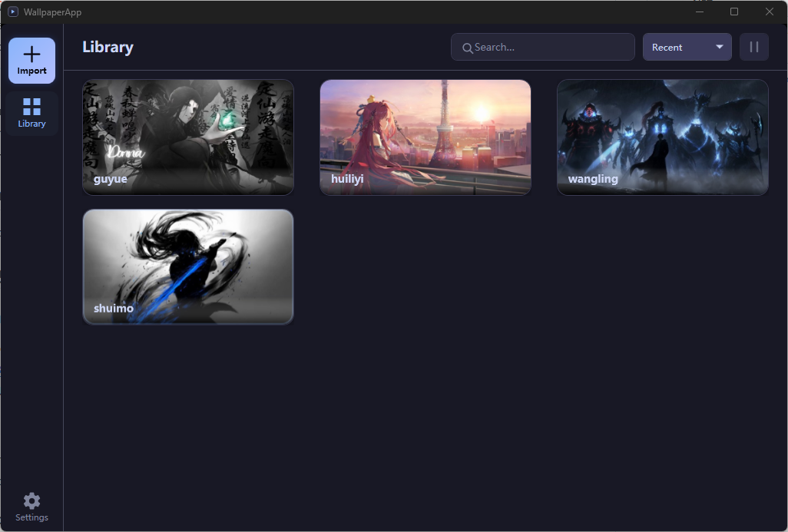

# WallpaperApp

> A Windows desktop application that plays video files (MP4, WebM, GIF, etc.) as live wallpapers behind your desktop icons.

[**中文版本**](README.zh-CN.md)

---

## Features

- **Video & GIF wallpapers** — Import local MP4, WebM, AVI, MOV, MKV, and GIF files and set them as desktop wallpaper.
- **Behind-desktop-icon rendering** — Wallpaper plays beneath desktop icons via Win32 WorkerW embedding, immune to Win+D and Z-order reshuffling.
- **Multi-monitor support** — Assign a different wallpaper to each monitor independently.
- **Hardware-accelerated playback** — D3D11VA hardware decode + DXGI flip-model swap chain with a GPU zero-copy path (NV12→RGB pixel shader, no CPU round-trip).
- **Software fallback** — FFmpeg software decode + Direct2D/DXGI CPU-upload rendering when GPU acceleration is unavailable.
- **Fullscreen auto-pause** — Pauses all wallpapers when a fullscreen borderless application is detected.
- **Battery-aware** — Automatically pauses wallpapers on battery power (laptop-friendly).
- **Remote-session aware** — Automatically pauses wallpapers during Remote Desktop (RDP) or screen-cast (Miracast) sessions to save bandwidth.
- **System tray** — Minimize-to-tray with a quick-pause context menu and language switching.
- **Library management** — Browse, search, and sort imported wallpapers with thumbnail previews.
- **Internationalization** — UI available in English and 中文 (Chinese), switchable at runtime.
- **Auto-start** — Optional launch with Windows.

## Screenshots




## Getting Started

### Prerequisites

- Windows 10 or later (64-bit)
- [.NET 8 Runtime](https://dotnet.microsoft.com/en-us/download/dotnet/8.0)
- A GPU with Direct3D 11 support (for hardware acceleration)

### Install

1. Download the latest release from the [Releases](https://github.com/yourname/WallpaperApp/releases) page.
2. Extract the archive and run `WallpaperApp.exe`.

### Build from source

```bash
# Clone
git clone https://github.com/yourname/WallpaperApp.git
cd WallpaperApp

# Build
dotnet build WallpaperApp.sln

# Run
dotnet run --project src/WallpaperApp

# Run tests
dotnet test tests/WallpaperApp.Tests
```

> **Note:** `lib/ffmpeg/` contains pre-built FFmpeg 7.x DLLs. The test project also requires `ffmpeg.exe` on PATH for cross-validation smoke tests.

## Tech Stack

| Layer | Technology |
|---|---|
| UI framework | WPF (.NET 8, Windows-only) |
| Desktop integration | Win32 P/Invoke (WorkerW, Shell_NotifyIcon) |
| Video decode | FFmpeg 7.x via P/Invoke (D3D11VA hardware decode optional) |
| Rendering | Direct3D 11 / DXGI flip-model swap chain (primary), Direct2D (fallback) |
| Shader compilation | `d3dcompiler_47.dll` runtime HLSL compile |
| Database | SQLite via Entity Framework Core |
| Localization | .NET resource files (.resx) |
| DI | Microsoft.Extensions.DependencyInjection |
| Testing | xUnit, Moq |

## Project Structure

```
WallpaperApp/
├── src/WallpaperApp/        # Main application
│   ├── App.xaml.cs          # Startup, DI wiring, exception handling
│   ├── Data/                # EF Core SQLite context
│   ├── Interop/             # Win32 & FFmpeg P/Invoke declarations
│   ├── Localization/        # String resources, language switching
│   ├── Models/              # Data models (AppSettings, WallpaperItem)
│   ├── Services/
│   │   ├── Desktop/         # WorkerW embedding, wallpaper window host
│   │   ├── Library/         # File import, thumbnails, metadata
│   │   ├── Logging/         # File-based daily log rotation
│   │   ├── Monitor/         # Monitor enumeration, fullscreen detection, power awareness
│   │   ├── Playback/        # Playback manager, FFmpeg backend, DXGI/D2D renderers
│   │   └── Settings/        # JSON settings persistence, auto-start registry
│   └── UI/
│       ├── Controls/        # Custom WPF controls (VideoFrameView, WallpaperCard)
│       ├── ViewModels/      # MainViewModel
│       ├── Views/           # Library, detail, settings, monitor-picker windows
│       └── TrayIcon.cs      # Hand-rolled system tray icon (Win32 NOTIFYICONDATA)
├── tests/
│   ├── WallpaperApp.Tests/           # xUnit unit tests
│   ├── WallpaperApp.FfmpegProbe/     # Standalone FFmpeg decode probe (test utility)
│   ├── WallpaperApp.HwDecodeProbe/   # D3D11VA hardware decode probe
│   └── WallpaperApp.RenderProbe/     # DXGI/D2D render test probe
├── lib/ffmpeg/              # FFmpeg 7.x native DLLs
└── docs/                    # Design documents & specifications
```

## Architecture Highlights

### Zero-Copy GPU Pipeline

The shared `GpuDevice` singleton enables a true zero-copy render path:

```
FFmpeg D3D11VA decode ──► NV12 texture (GPU) ──► NV12→RGB pixel shader ──► DXGI flip-model swap chain
                                │
                          (no CPU round-trip)
```

When the shared device is unavailable, decoding falls back to software and rendering uses a CPU upload path (BGRA buffer → staging texture → back buffer).

### Render Thread Isolation

Each monitor has its own dedicated render thread that owns both the Win32 wallpaper window and the D2D/DXGI render target. This is a requirement of Direct2D's single-threaded factory — violating it causes `EndDraw()` to return `S_OK` with no visible output.

### Pause Reason Accounting

Multiple pause sources (user, fullscreen, battery) are tracked independently via a `HashSet<PauseReason>`. A session pauses on empty→non-empty and resumes on last→empty, ensuring auto-pause never clobbers manual pause and vice versa.

## License

*(Specify your license here)*
